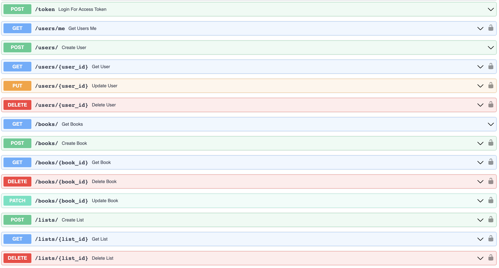
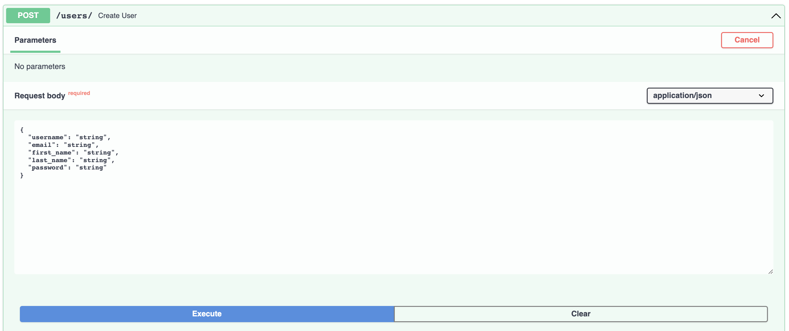
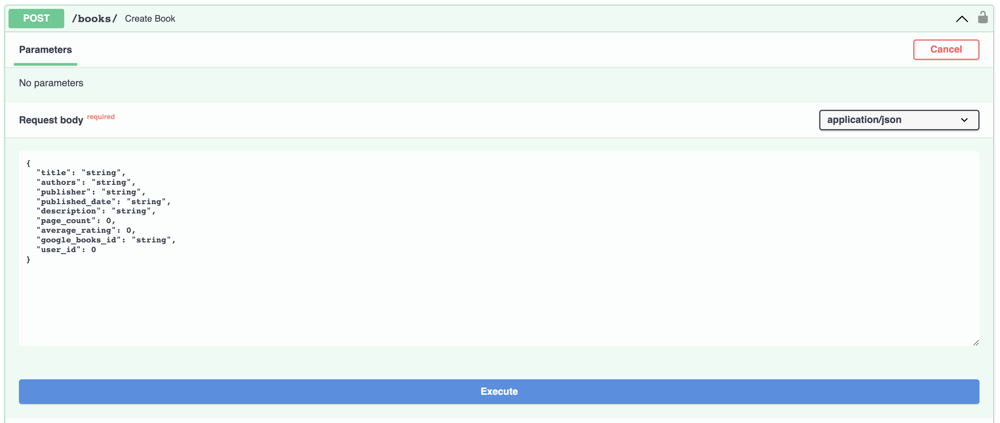
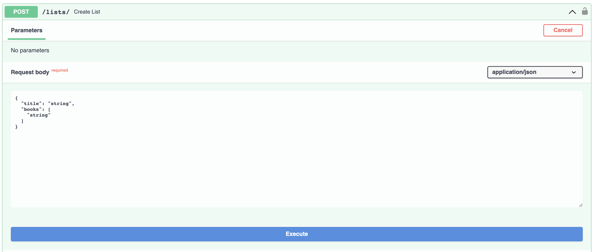

## General Info

FastAPI application allowing individuals to manage their reading lists from an ever-growing books database. It includes endpoints for managing users, books and lists using POST, GET, PATCH, DELETE and PUT with additional endpoints for user password encryption and OAuth. 

This API also interfaces with a terminal application built using Typer and leveraging Google Books API. Please feel free to check it out here: https://github.com/BenGriffith/book-api-cli. 

Swagger / OpenAPI



Create User



Create Book



Create Reading List



## Setup
To run this project, follow the steps below:
```
$ git clone https://github.com/BenGriffith/book-api.git
$ cd book-api
$ python3 -m virtualenv venv
$ source venv/bin/activate
$ cd app/
$ cp .env-template .env
```

Open .env and populate the environment variables:
```
POSTGRES_USER= ## Your database user such as postgres
POSTGRES_PASSWORD= ## Your database password
POSTGRES_DB= ## Your database name

DEBUG= ## True or False
SECRET_KEY= ## Generate a string using 'openssl rand -hex 32' or similar method
ALGORITHM=HS256
ACCESS_TOKEN_EXPIRE_MINUTES= ## 30, 60, 90, 120, 240, etc.
```

Finally, make certain you are in the project root directory and then execute the following command:
```
$ docker-compose --env-file app/.env up -d
```

To validate setup, navigate to your browser and type in `http://localhost:8000/docs`. You should see content similar to the Swagger / OpenAPI screenshots referenced above. Alternatively, you could run `$ curl http://localhost:8000/docs` from the command line and verify the HTML output.